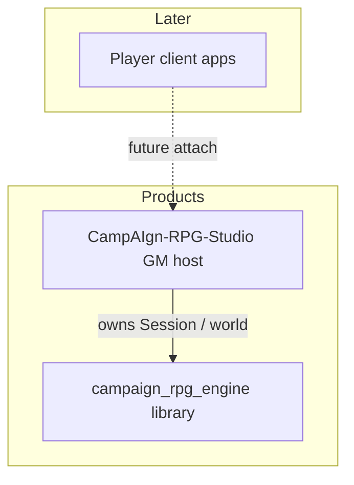

# System overview

CampAIgn splits into a **simulation library** and a **GM host**. Player clients attaching to Studio are planned later (not in 1.6.0).

| Layer | Role |
|-------|------|
| **Engine** | Typed `Session` API, areas, turns, memory, prompts, LLM helpers |
| **Studio** | GM authoring UI + HTTP API; process-wide single session today |
| **Clients** | Future: control a player agent against Studio’s world |

Engine is published on **PyPI**. Studio is **GitHub-only**.
