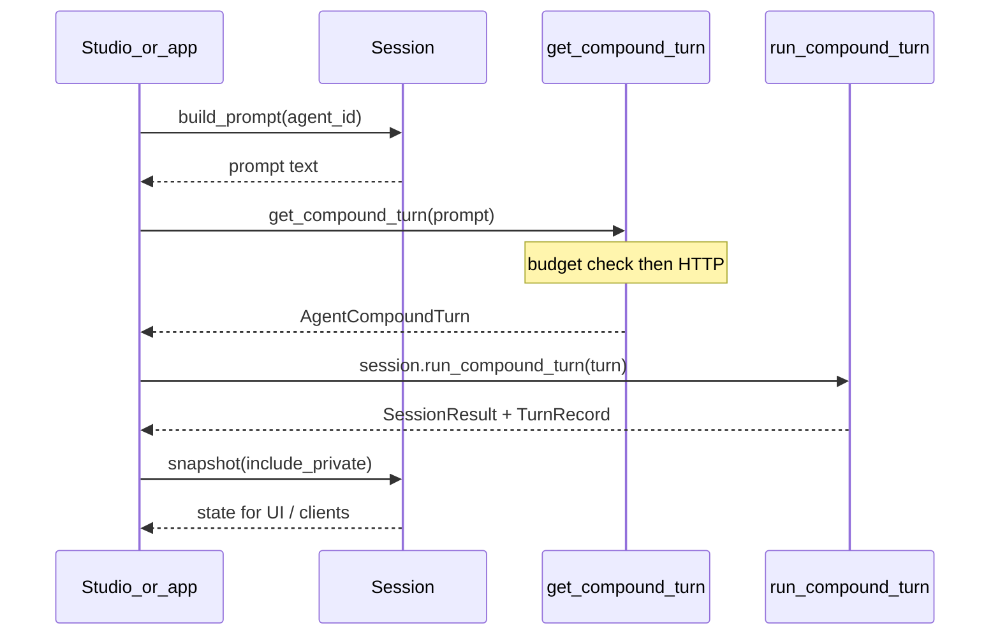

# Session turn flow

Happy path for an NPC (LLM) compound turn hosted by Studio or any app.

Key modules:

- Prompt assembly: `session.py`, `prompt_blocks.py`, `llm/prompt_context.py`
- LLM: `llm/client.py` (providers, token budget, JSON brace repair)
- Simulation: `simulation.py`, `actions/`
