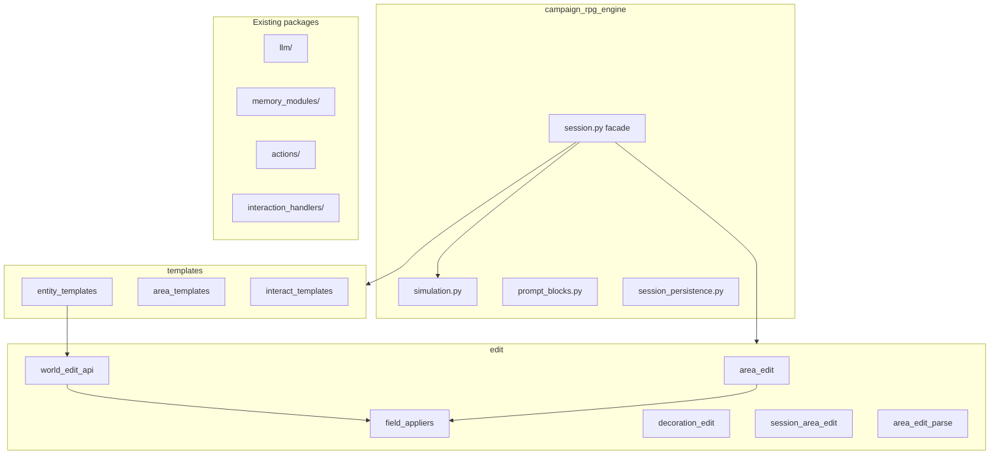

# Package layout (1.6.0)

After regrouping edit and template modules. Public imports stay on `campaign_rpg_engine` (`__all__`) and top-level **compat shims** (e.g. `campaign_rpg_engine.area_edit`).

**Left large on purpose:** `session.py` (~1.2k) remains the public facade; splitting method surface is out of scope for 1.6.0.

**Shims:** top-level `area_edit.py`, `world_edit_api.py`, `entity_templates.py`, etc. alias to the real modules via `sys.modules` so Studio/plugins keep old import paths.
