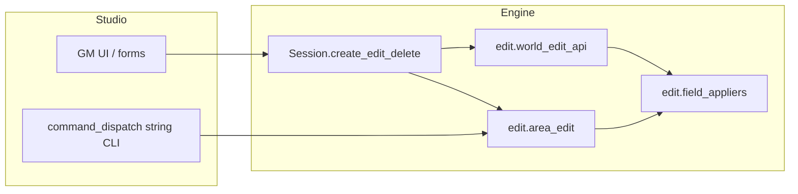

# Edit mutation stack

Three layers mutate the world. Prefer typed `Session` methods in product code.

| Path | When to use |
|------|-------------|
| `Session.create_*` / `edit_*` / `delete_*` | Apps and Studio typed HTTP APIs |
| `edit.world_edit_api` | Shared typed helpers behind Session |
| `edit.area_edit` + `area_edit_parse` | String field tokens; Studio `POST /api/command` |
| `edit.field_appliers` | Internal shared field application (not public API) |

Studio owns stepper-style command strings in `backend/command_dispatch.py`. Engine does not ship a CLI.
